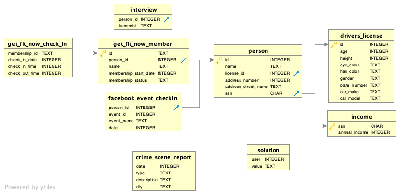

# SQL Murder Mystery
A crime has taken place and the detective needs your help. The detective gave you the crime scene report, but you somehow lost it. You vaguely remember that the crime was a murder that occurred sometime on **Jan.15, 2018** and that it took place in SQL City. All the clues to this mystery are buried in a huge database, and you need to use SQL to navigate through this vast network of information. Your first step to solving the mystery is to retrieve the corresponding crime scene report from the police department’s database. Take a look at the cheatsheet to learn how to do this! From there, you can use your SQL skills to find the murderer.

## Exploring tables, see the schema below


#### interview:


```sql
%%sql
SELECT * FROM interview LIMIT 5
```


<table>
    <thead>
        <tr>
            <th>person_id</th>
            <th>transcript</th>
        </tr>
    </thead>
    <tbody>
        <tr>
            <td>28508</td>
            <td>‘I deny it!’ said the March Hare.<br></td>
        </tr>
        <tr>
            <td>63713</td>
            <td><br></td>
        </tr>
        <tr>
            <td>86208</td>
            <td>way, and the whole party swam to the shore.<br></td>
        </tr>
        <tr>
            <td>35267</td>
            <td>lessons in here? Why, there’s hardly room for YOU, and no room at all<br></td>
        </tr>
        <tr>
            <td>33856</td>
            <td><br></td>
        </tr>
    </tbody>
</table>


#### get_fit_now_check_in:


```sql
%%sql
SELECT * FROM get_fit_now_check_in LIMIT 5;
```


<table>
    <thead>
        <tr>
            <th>membership_id</th>
            <th>check_in_date</th>
            <th>check_in_time</th>
            <th>check_out_time</th>
        </tr>
    </thead>
    <tbody>
        <tr>
            <td>NL318</td>
            <td>20180212</td>
            <td>329</td>
            <td>365</td>
        </tr>
        <tr>
            <td>NL318</td>
            <td>20170811</td>
            <td>469</td>
            <td>920</td>
        </tr>
        <tr>
            <td>NL318</td>
            <td>20180429</td>
            <td>506</td>
            <td>554</td>
        </tr>
        <tr>
            <td>NL318</td>
            <td>20180128</td>
            <td>124</td>
            <td>759</td>
        </tr>
        <tr>
            <td>NL318</td>
            <td>20171027</td>
            <td>418</td>
            <td>1019</td>
        </tr>
    </tbody>
</table>


#### get_fit_now_member:


```sql
%%sql
SELECT * FROM get_fit_now_member LIMIT 5;
```


<table>
    <thead>
        <tr>
            <th>id</th>
            <th>person_id</th>
            <th>name</th>
            <th>membership_start_date</th>
            <th>membership_status</th>
        </tr>
    </thead>
    <tbody>
        <tr>
            <td>NL318</td>
            <td>65076</td>
            <td>Everette Koepke</td>
            <td>20170926</td>
            <td>gold</td>
        </tr>
        <tr>
            <td>AOE21</td>
            <td>39426</td>
            <td>Noe Locascio</td>
            <td>20171005</td>
            <td>regular</td>
        </tr>
        <tr>
            <td>2PN28</td>
            <td>63823</td>
            <td>Jeromy Heitschmidt</td>
            <td>20180215</td>
            <td>silver</td>
        </tr>
        <tr>
            <td>0YJ24</td>
            <td>80651</td>
            <td>Waneta Wellard</td>
            <td>20171206</td>
            <td>gold</td>
        </tr>
        <tr>
            <td>3A08L</td>
            <td>32858</td>
            <td>Mei Bianchin</td>
            <td>20170401</td>
            <td>silver</td>
        </tr>
    </tbody>
</table>


#### facebook_event_checkin:


```sql
%%sql
SELECT * FROM facebook_event_checkin LIMIT 5;
```


<table>
    <thead>
        <tr>
            <th>person_id</th>
            <th>event_id</th>
            <th>event_name</th>
            <th>date</th>
        </tr>
    </thead>
    <tbody>
        <tr>
            <td>28508</td>
            <td>5880</td>
            <td>Nudists are people who wear one-button suits.<br></td>
            <td>20170913</td>
        </tr>
        <tr>
            <td>63713</td>
            <td>3865</td>
            <td>but that&#x27;s because it&#x27;s the best book on anything for the layman.<br></td>
            <td>20171009</td>
        </tr>
        <tr>
            <td>63713</td>
            <td>3999</td>
            <td>&nbsp;&nbsp;&nbsp;&nbsp;&nbsp;&nbsp;&nbsp;&nbsp;If Murphy&#x27;s Law can go wrong, it will.<br></td>
            <td>20170502</td>
        </tr>
        <tr>
            <td>63713</td>
            <td>6436</td>
            <td>Old programmers never die.  They just branch to a new address.<br></td>
            <td>20170926</td>
        </tr>
        <tr>
            <td>82998</td>
            <td>4470</td>
            <td>Help a swallow land at Capistrano.<br></td>
            <td>20171022</td>
        </tr>
    </tbody>
</table>


#### person:


```sql
%%sql
SELECT * FROM person LIMIT 5;
```


<table>
    <thead>
        <tr>
            <th>id</th>
            <th>name</th>
            <th>license_id</th>
            <th>address_number</th>
            <th>address_street_name</th>
            <th>ssn</th>
        </tr>
    </thead>
    <tbody>
        <tr>
            <td>10000</td>
            <td>Christoper Peteuil</td>
            <td>993845</td>
            <td>624</td>
            <td>Bankhall Ave</td>
            <td>747714076</td>
        </tr>
        <tr>
            <td>10007</td>
            <td>Kourtney Calderwood</td>
            <td>861794</td>
            <td>2791</td>
            <td>Gustavus Blvd</td>
            <td>477972044</td>
        </tr>
        <tr>
            <td>10010</td>
            <td>Muoi Cary</td>
            <td>385336</td>
            <td>741</td>
            <td>Northwestern Dr</td>
            <td>828638512</td>
        </tr>
        <tr>
            <td>10016</td>
            <td>Era Moselle</td>
            <td>431897</td>
            <td>1987</td>
            <td>Wood Glade St</td>
            <td>614621061</td>
        </tr>
        <tr>
            <td>10025</td>
            <td>Trena Hornby</td>
            <td>550890</td>
            <td>276</td>
            <td>Daws Hill Way</td>
            <td>223877684</td>
        </tr>
    </tbody>
</table>


#### drivers_license:


```sql
%%sql
SELECT * FROM drivers_license LIMIT 5;
```


<table>
    <thead>
        <tr>
            <th>id</th>
            <th>age</th>
            <th>height</th>
            <th>eye_color</th>
            <th>hair_color</th>
            <th>gender</th>
            <th>plate_number</th>
            <th>car_make</th>
            <th>car_model</th>
        </tr>
    </thead>
    <tbody>
        <tr>
            <td>100280</td>
            <td>72</td>
            <td>57</td>
            <td>brown</td>
            <td>red</td>
            <td>male</td>
            <td>P24L4U</td>
            <td>Acura</td>
            <td>MDX</td>
        </tr>
        <tr>
            <td>100460</td>
            <td>63</td>
            <td>72</td>
            <td>brown</td>
            <td>brown</td>
            <td>female</td>
            <td>XF02T6</td>
            <td>Cadillac</td>
            <td>SRX</td>
        </tr>
        <tr>
            <td>101029</td>
            <td>62</td>
            <td>74</td>
            <td>green</td>
            <td>green</td>
            <td>female</td>
            <td>VKY5KR</td>
            <td>Scion</td>
            <td>xB</td>
        </tr>
        <tr>
            <td>101198</td>
            <td>43</td>
            <td>54</td>
            <td>amber</td>
            <td>brown</td>
            <td>female</td>
            <td>Y5NZ08</td>
            <td>Nissan</td>
            <td>Rogue</td>
        </tr>
        <tr>
            <td>101255</td>
            <td>18</td>
            <td>79</td>
            <td>blue</td>
            <td>grey</td>
            <td>female</td>
            <td>5162Z1</td>
            <td>Lexus</td>
            <td>GS</td>
        </tr>
    </tbody>
</table>


#### income:


```sql
%%sql
SELECT * FROM income LIMIT 5;
```


<table>
    <thead>
        <tr>
            <th>ssn</th>
            <th>annual_income</th>
        </tr>
    </thead>
    <tbody>
        <tr>
            <td>100009868</td>
            <td>52200</td>
        </tr>
        <tr>
            <td>100169584</td>
            <td>64500</td>
        </tr>
        <tr>
            <td>100300433</td>
            <td>74400</td>
        </tr>
        <tr>
            <td>100355733</td>
            <td>35900</td>
        </tr>
        <tr>
            <td>100366269</td>
            <td>73000</td>
        </tr>
    </tbody>
</table>


#### crime_scene_report:


```sql
%%sql
SELECT * FROM crime_scene_report LIMIT 5;
```


<table>
    <thead>
        <tr>
            <th>date</th>
            <th>type</th>
            <th>description</th>
            <th>city</th>
        </tr>
    </thead>
    <tbody>
        <tr>
            <td>20180115</td>
            <td>robbery</td>
            <td>A Man Dressed as Spider-Man Is on a Robbery Spree</td>
            <td>NYC</td>
        </tr>
        <tr>
            <td>20180115</td>
            <td>murder</td>
            <td>Life? Dont talk to me about life.</td>
            <td>Albany</td>
        </tr>
        <tr>
            <td>20180115</td>
            <td>murder</td>
            <td>Mama, I killed a man, put a gun against his head...</td>
            <td>Reno</td>
        </tr>
        <tr>
            <td>20180215</td>
            <td>murder</td>
            <td>REDACTED REDACTED REDACTED</td>
            <td>SQL City</td>
        </tr>
        <tr>
            <td>20180215</td>
            <td>murder</td>
            <td>Someone killed the guard! He took an arrow to the knee!</td>
            <td>SQL City</td>
        </tr>
    </tbody>
</table>


#### Check the format of the dates and extract useful reports from `crime_scene_report`:


```sql
%%sql
SELECT  date,
        TO_DATE(CAST(date AS VARCHAR ), 'YYYYMMDD') AS date_check,
        type,
        description,
        city
FROM crime_scene_report
WHERE type = 'murder'
AND city = 'SQL City'
AND date = 20180115;

```


<table>
    <thead>
        <tr>
            <th>date</th>
            <th>date_check</th>
            <th>type</th>
            <th>description</th>
            <th>city</th>
        </tr>
    </thead>
    <tbody>
        <tr>
            <td>20180115</td>
            <td>2018-01-15</td>
            <td>murder</td>
            <td>Security footage shows that there were 2 witnesses. The first witness lives at the last house on &quot;Northwestern Dr&quot;. The second witness, named Annabel, lives somewhere on &quot;Franklin Ave&quot;.</td>
            <td>SQL City</td>
        </tr>
    </tbody>
</table>


**Description of the event:**

_Security footage shows that there were 2 witnesses. The first witness lives at the last house on "Northwestern Dr". The second witness, named Annabel, lives somewhere on "Franklin Ave"._

#### Create `view` named `witnesses` with information about the witnesses:


```sql
%%sql
-- drop already created views to run this notebook codes again
DROP VIEW IF EXISTS suspect_check_ins;
DROP VIEW IF EXISTS alice_gym_time;
DROP VIEW IF EXISTS witnesses;
```


    []


```sql
%%sql
CREATE VIEW witnesses AS
SELECT *
FROM person
WHERE (address_street_name = 'Northwestern Dr'
        AND address_number >= ALL(SELECT address_number FROM person))
OR (address_street_name = 'Franklin Ave' AND name LIKE 'Annabel%');
```


    []


```sql
%%sql
SELECT * FROM witnesses;
```


<table>
    <thead>
        <tr>
            <th>id</th>
            <th>name</th>
            <th>license_id</th>
            <th>address_number</th>
            <th>address_street_name</th>
            <th>ssn</th>
        </tr>
    </thead>
    <tbody>
        <tr>
            <td>14887</td>
            <td>Morty Schapiro</td>
            <td>118009</td>
            <td>4919</td>
            <td>Northwestern Dr</td>
            <td>111564949</td>
        </tr>
        <tr>
            <td>16371</td>
            <td>Annabel Miller</td>
            <td>490173</td>
            <td>103</td>
            <td>Franklin Ave</td>
            <td>318771143</td>
        </tr>
    </tbody>
</table>


#### Check the interviews with those people:


```sql
%%sql
SELECT witnesses.id AS person_id,
    name,
    transcript
FROM witnesses LEFT JOIN interview ON witnesses.id = interview.person_id;
```


<table>
    <thead>
        <tr>
            <th>person_id</th>
            <th>name</th>
            <th>transcript</th>
        </tr>
    </thead>
    <tbody>
        <tr>
            <td>14887</td>
            <td>Morty Schapiro</td>
            <td>I heard a gunshot and then saw a man run out. He had a &quot;Get Fit Now Gym&quot; bag. The membership number on the bag started with &quot;48Z&quot;. Only gold members have those bags. The man got into a car with a plate that included &quot;H42W&quot;.</td>
        </tr>
        <tr>
            <td>16371</td>
            <td>Annabel Miller</td>
            <td>I saw the murder happen, and I recognized the killer from my gym when I was working out last week on January the 9th.</td>
        </tr>
    </tbody>
</table>


#### Clues:
- **Morty Schapiro:**
_I heard a gunshot and then saw a man run out. He had a "Get Fit Now Gym" bag. The membership number on the bag started with "48Z". Only gold members have those bags. The man got into a car with a plate that included "H42W"_
- **Annabel Miller:**
_I saw the murder happen, and I recognized the killer from my gym when I was working out last week on January the 9th._

Create `view` named `alice_gym_time` to find out times at which Alice was in the gym and use them later:


```sql
%%sql
CREATE VIEW alice_gym_time AS
SELECT membership_id,
       check_in_date,
       check_in_time,
       check_out_time
FROM get_fit_now_check_in JOIN get_fit_now_member ON membership_id = id
WHERE check_in_date = 20180109
AND membership_id IN
    (SELECT get_fit_now_member.id
    FROM witnesses JOIN get_fit_now_member ON witnesses.id = get_fit_now_member.person_id
    WHERE witnesses.id = 16371);
```


    []


```sql
%%sql
SELECT * FROM alice_gym_time;
```


<table>
    <thead>
        <tr>
            <th>membership_id</th>
            <th>check_in_date</th>
            <th>check_in_time</th>
            <th>check_out_time</th>
        </tr>
    </thead>
    <tbody>
        <tr>
            <td>90081</td>
            <td>20180109</td>
            <td>1600</td>
            <td>1700</td>
        </tr>
    </tbody>
</table>


#### Create `view` named `suspect_check_ins` to list membership ids beginning with '48Z' of people who were in the gym at the same time as Alice:


```sql
%%sql
CREATE VIEW suspect_check_ins AS
SELECT *
FROM get_fit_now_check_in
WHERE check_in_date = 20180109
AND check_in_time + check_out_time BETWEEN
        (SELECT (check_in_time + check_out_time) - (check_out_time - check_in_time) FROM alice_gym_time)
         AND
        (SELECT (check_in_time + check_out_time) + (check_out_time - check_in_time) FROM alice_gym_time)
AND membership_id <> (SELECT membership_id FROM alice_gym_time)
AND membership_id LIKE '48Z%';
```


    []


```sql
%%sql
SELECT * FROM suspect_check_ins;
```


<table>
    <thead>
        <tr>
            <th>membership_id</th>
            <th>check_in_date</th>
            <th>check_in_time</th>
            <th>check_out_time</th>
        </tr>
    </thead>
    <tbody>
        <tr>
            <td>48Z7A</td>
            <td>20180109</td>
            <td>1600</td>
            <td>1730</td>
        </tr>
        <tr>
            <td>48Z55</td>
            <td>20180109</td>
            <td>1530</td>
            <td>1700</td>
        </tr>
    </tbody>
</table>


#### Identify the name of the murderer based on the membership ids from `suspect_check_ins` and its plate number containing 'H42'


```sql
%%sql
SELECT person.name
FROM person JOIN drivers_license ON license_id = drivers_license.id
WHERE plate_number LIKE '%H42W%'
AND person.id IN
    (SELECT person_id
     FROM suspect_check_ins JOIN get_fit_now_member ON membership_id = id
     WHERE membership_id = get_fit_now_member.id)

```


<table>
    <thead>
        <tr>
            <th>name</th>
        </tr>
    </thead>
    <tbody>
        <tr>
            <td>Jeremy Bowers</td>
        </tr>
    </tbody>
</table>


#### The solution checker confirms 'Jeremy Bowers' as the murderer, but there is supposedly someone, who is the big brain of this crime!


```sql
%%sql
SELECT person_id,
       name,
       transcript
FROM interview JOIN person ON person_id = id
WHERE name = 'Jeremy Bowers'
```


<table>
    <thead>
        <tr>
            <th>person_id</th>
            <th>name</th>
            <th>transcript</th>
        </tr>
    </thead>
    <tbody>
        <tr>
            <td>67318</td>
            <td>Jeremy Bowers</td>
            <td>I was hired by a woman with a lot of money. I don&#x27;t know her name but I know she&#x27;s around 5&#x27;5&quot; (65&quot;) or 5&#x27;7&quot; (67&quot;). She has red hair and she drives a Tesla Model S. I know that she attended the SQL Symphony Concert 3 times in December 2017.<br></td>
        </tr>
    </tbody>
</table>


Find the brain behind the murder based on this information from interview:

_I was hired by a woman with a lot of money. I don't know her name, but I know she's around 5'5" (65") or 5'7" (67"). She has red hair and she drives a Tesla Model S. I know that she attended the SQL Symphony Concert 3 times in December 2017._


```sql
%%sql
SELECT person.name,
       height,
       hair_color,
       car_make,
       car_model,
       event_name,
       annual_income,
       COUNT(date) AS number_of_attendences
FROM person JOIN drivers_license ON license_id = drivers_license.id
            JOIN facebook_event_checkin ON person.id = person_id
            JOIN income ON person.ssn = income.ssn
WHERE height BETWEEN 65 AND 67
AND hair_color = 'red'
AND car_make = 'Tesla'
GROUP BY person.name, height, hair_color, car_make, car_model, event_name, annual_income;

```


<table>
    <thead>
        <tr>
            <th>name</th>
            <th>height</th>
            <th>hair_color</th>
            <th>car_make</th>
            <th>car_model</th>
            <th>event_name</th>
            <th>annual_income</th>
            <th>number_of_attendences</th>
        </tr>
    </thead>
    <tbody>
        <tr>
            <td>Miranda Priestly</td>
            <td>66</td>
            <td>red</td>
            <td>Tesla</td>
            <td>Model S</td>
            <td>SQL Symphony Concert</td>
            <td>310000</td>
            <td>3</td>
        </tr>
    </tbody>
</table>


#### The solution checker confirms 'Miranda Priestly' as the criminal behind the murder.

## Case closed!
